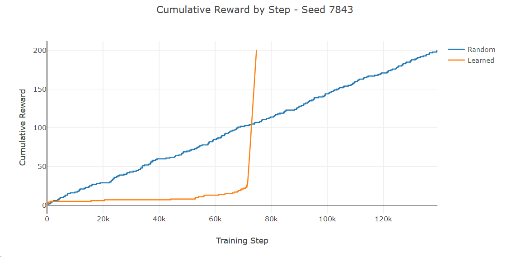

# Coding Assignment

### Scripts

Files `part1.py` and `part2.py` implement the prompts and produce relevant charts 
which will open in your default browser.

## Installation

### Requirements

 - Python 2.7

### Setup

I recommend creating a virtual environment of your choice (pipenv, venv, conda) before installation
however that is not required. e.g.

```
pip install pipenv
pipenv --python 2.7
pipenv shell
```

`pip install -U -r requirements.txt`

#### Tests + Coverage

`pytest --cov`

## Discussion

### Part 1

The initial task was to implement a Q-Learning agent to solve a gridworld maze which changes after
1000 steps.

To implement this I modified the [CliffWalkingEnv](https://github.com/openai/gym/blob/master/gym/envs/toy_text/cliffwalking.py) 
from the OpenAI Gym toytext suite to use a
wall rather than a cliff. Like CliffWalking the Gridworld environment is deterministic.

Next I implemented a QAgent class to manage the agent policy, select actions, and perform learning
updates.

Finally I instrumented the main script with relevant visualizations of learning progress using
plotly.

#### Usage

`python part1.py` to run.

`python part1.py --help` for all options.

This will train a `QAgent` until it accumulates 200 reward (by default). A random version 
of the QAgent will also be run as a baseline.

The script will generate four charts.

 - A visualization of the greedy version of the policy after 1000 steps
 - A graph of the cumulative reward over the first 1000 steps
 - A visualization of the greedy version of the policy after all training steps
 - A graph of the cumulative reward after all training_steps

The final chart should look like this:
<p align="center"></p>

#### Notes

There is an interesting edge case here. If, prior to the wall update, the agent has not
accumulated sufficient reward, the Q-table will not be populated with any values
below the wall. This makes it *easier* for the agent to learn following the wall update. It
doesn't have to unlearn anything as the portion of the Q-table below the wall is still
essentially random. You can observe this with:

`python part1.py --seed-type bad`

If an agent receives sufficient reward prior to the wall update then it has to overcome prior
knowledge and this takes substantially more time. Judging from the prompt this is the
preferred case.

In part 2 we modify the wall-shift to 2000 steps to make it much more likely that agents 
have learned sufficiently before demonstrating relearning.

### Part 2

The second task is to extend the previous training to support parallel and asynchronous updates 
to the policy. An optional component was to use multiprocessing rather than threading and
that is done here.

The implementation draws heavily from [SubprocVecEnv](https://github.com/hill-a/stable-baselines/blob/master/stable_baselines/common/vec_env/subproc_vec_env.py) 
in stable-baselines. While that library 
allows for easy parallel training it is synchronous across environments requires Python 3.

I back-ported and adapted several key pieces of that library to provide a vector of
`AsyncQAgents` which each manage their own env and are trained asynchronously. Each agent updates
the shared multiprocessing.Array object (Q-Table) every `async_update` steps.

#### Usage

`python part2.py` to run.

`python part2.py --help` for all options.

This will train [2, 4, 6, 8] agents on the gridworld. `wall_shift` is set to 2000 as noted above
to allow for sufficient early learning.

The script will generate nine charts.

For each `worker_count` it will generate:

 - A visualization of the greedy version of the policy after all training steps
 - A graph of the cumulative reward after all training_steps, for each worker and on average

Finally it will generate:

 - A graph of the average cumulative reward across the previous runs to compare the impact
   of increasing `worker_count`.

The final chart should look like this:
<p align="center"></p>

#### Notes

Hyperparameters are not tuned to produce the fastest training runs. Instead they are set to
more clearly visualize the influence of `worker_count` on training.

### Part 3

The final task is to implement a deep Q network (DQN) in the style of the original Nature paper
and train it on the Space Invaders gym environment.

`part3.py` is the start of this implementation but it is incomplete due to time constraints.
Please review the code to see the extension of work from Part 2. Generally the approach 
follows the same pattern:

A shared policy (now with separate lock) is passed to multiple agents each with their own
gym environment.

#### Usage

As this is incomplete code there are additional requirements to get it running.

 - Python 3.6+
 - [pytorch](https://pytorch.org/get-started/locally/)
 - [stable-baselines](https://github.com/hill-a/stable-baselines)

`python part3.py` - WARNING: This will consume all available CPU.

